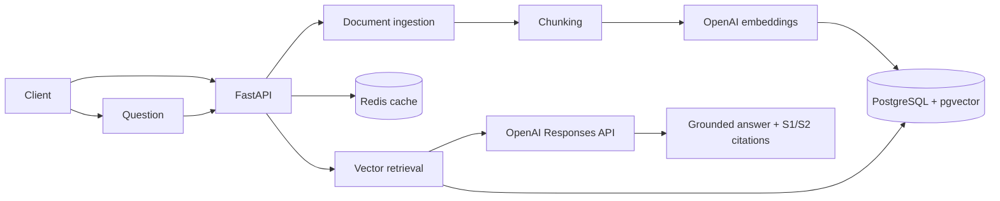

# RAG Knowledge Assistant

[](https://github.com/kdromanovich/rag-knowledge-assistant/actions/workflows/ci.yml)

[Русская версия](README_RU.md)

A production-oriented **reference implementation** of a Retrieval-Augmented Generation API built with **Python, FastAPI, PostgreSQL, pgvector, Redis and OpenAI**. It ingests documents, creates embeddings, retrieves semantically relevant chunks and generates grounded answers with explicit source references.

## Why this project exists

This repository demonstrates an AI backend beyond low-code workflow orchestration: async API development, relational persistence, vector search, document ingestion, caching, authentication, containerization, integration testing and CI.

## Architecture



## Features

- `POST /v1/documents` for PDF, TXT and Markdown ingestion;
- configurable overlapping chunking;
- OpenAI embeddings;
- cosine similarity retrieval in pgvector;
- grounded generation with `[S1]`, `[S2]` source markers;
- PostgreSQL persistence with SQLAlchemy 2 async ORM;
- Redis response cache;
- API-key authentication;
- file-size validation and explicit format handling;
- Docker Compose environment;
- pytest, Ruff and GitHub Actions CI.

## CI verification

The CI pipeline starts real **PostgreSQL + pgvector** and **Redis** service containers. In addition to unit tests, it runs an API round-trip that checks authentication, document ingestion, vector persistence/retrieval, grounded response assembly and Redis cache reuse. OpenAI calls are replaced by deterministic test doubles so CI does not require paid credentials.

## Quick start

```bash
cp .env.example .env
# Put OPENAI_API_KEY into .env
docker compose up --build
```

Open `http://localhost:8000/docs`.

### Ingest a document

```bash
curl -X POST http://localhost:8000/v1/documents \
  -H 'x-api-key: change-me' \
  -F 'file=@./example.pdf'
```

### Ask a question

```bash
curl -X POST http://localhost:8000/v1/chat \
  -H 'content-type: application/json' \
  -H 'x-api-key: change-me' \
  -d '{"question":"What does the document say about the launch plan?"}'
```

## API

| Method | Path | Purpose |
|---|---|---|
| GET | `/health` | Database/Redis health |
| POST | `/v1/documents` | Ingest and embed a document |
| POST | `/v1/chat` | Retrieve context and answer with sources |

## Repository structure

```text
app/                  FastAPI application and RAG services
tests/                unit + integration tests
.github/workflows/    CI with PostgreSQL/pgvector + Redis
Dockerfile             application image
docker-compose.yml     API + PostgreSQL/pgvector + Redis
```

## Scope and production hardening

This is a portfolio-grade reference implementation, not a claim of a live customer production deployment. For an internet-facing production system, add Alembic migrations, object storage, tenant isolation, document ACL filtering, background ingestion for large files, request tracing, managed secrets and an API gateway/WAF.

## License

MIT
