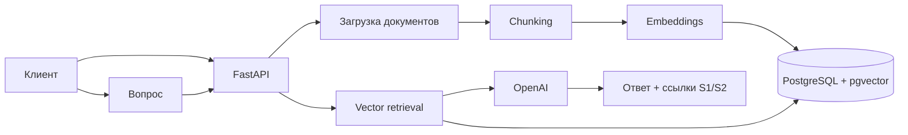

# RAG Knowledge Assistant

Полноценный backend-проект RAG на **Python, FastAPI, PostgreSQL, pgvector, Redis и OpenAI**. Сервис принимает документы, разбивает их на фрагменты, строит embeddings, выполняет векторный поиск и отвечает только на основе найденного контекста со ссылками на источники.

## Что демонстрирует проект

- Python backend и FastAPI;
- SQLAlchemy 2 и PostgreSQL;
- векторный поиск через pgvector;
- OpenAI embeddings и Responses API;
- Redis-кеширование;
- API-key авторизацию;
- обработку PDF/TXT/Markdown;
- Docker Compose;
- тесты, Ruff и GitHub Actions.

## Архитектура



## Запуск

```bash
cp .env.example .env
# Добавить OPENAI_API_KEY
docker compose up --build
```

Swagger: `http://localhost:8000/docs`.

## Основные endpoints

- `GET /health`
- `POST /v1/documents`
- `POST /v1/chat`

Проект специально сделан как кодовый AI/backend-кейс, дополняющий n8n-портфолио.
