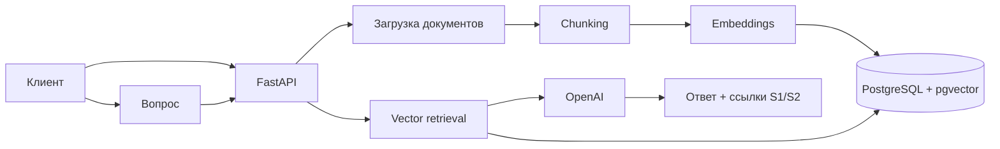

# RAG Knowledge Assistant

[](https://github.com/kdromanovich/rag-knowledge-assistant/actions/workflows/ci.yml)

Production-oriented reference backend RAG на **Python, FastAPI, PostgreSQL, pgvector, Redis и OpenAI**. Сервис принимает документы, разбивает их на фрагменты, строит embeddings, выполняет векторный поиск и отвечает только на основе найденного контекста со ссылками на источники.

## Что демонстрирует проект

- Python backend и FastAPI;
- SQLAlchemy 2 и PostgreSQL;
- векторный поиск через pgvector;
- OpenAI embeddings и Responses API;
- Redis-кеширование;
- API-key авторизацию;
- обработку PDF/TXT/Markdown;
- Docker Compose;
- unit + integration tests, Ruff и GitHub Actions.

## Архитектура



## Что реально проверяет CI

GitHub Actions поднимает PostgreSQL с pgvector и Redis. Integration-тест проходит через FastAPI: проверяет API-key, загрузку документа, запись embeddings в pgvector, vector retrieval, сборку grounded-ответа и повторный ответ из Redis cache. Вызовы OpenAI в CI заменены детерминированными test doubles, поэтому платный API-ключ для проверки не нужен.

## Запуск

```bash
cp .env.example .env
# Добавить OPENAI_API_KEY
docker compose up --build
```

Swagger: `http://localhost:8000/docs`.

## Основные endpoints

- `GET /health`
- `POST /v1/documents`
- `POST /v1/chat`

## Статус проекта

Это portfolio/reference implementation, а не заявление о customer production deployment. Для internet-facing production потребуются миграции, object storage, tenant/ACL isolation, background ingestion, tracing, secrets management и API gateway/WAF.
